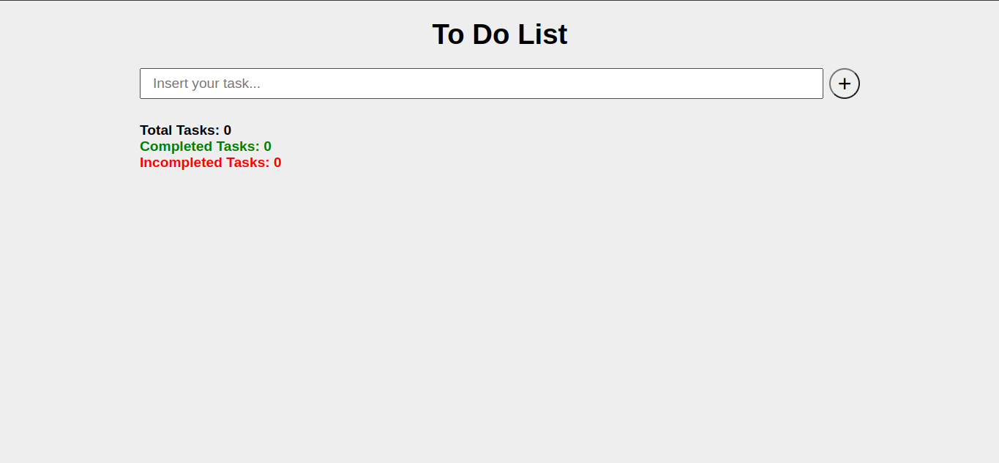
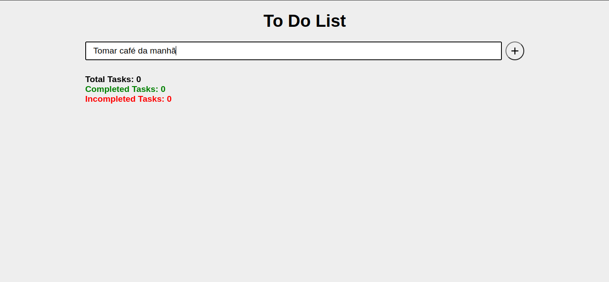
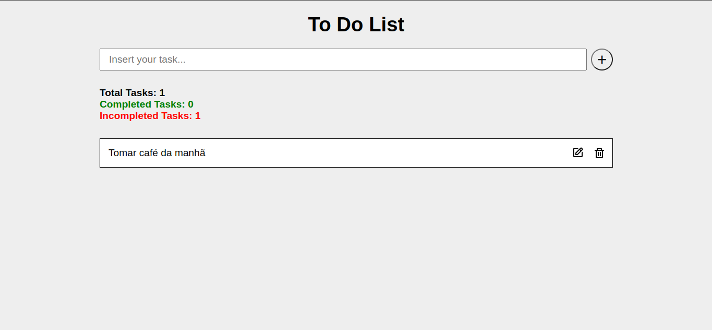
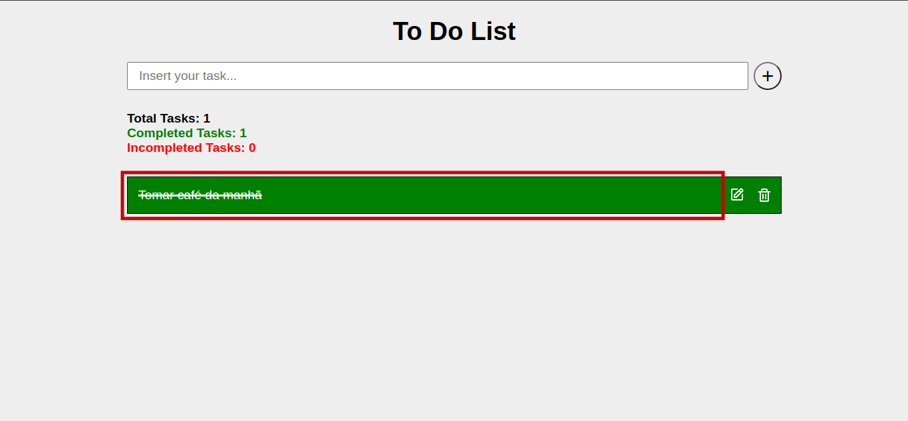
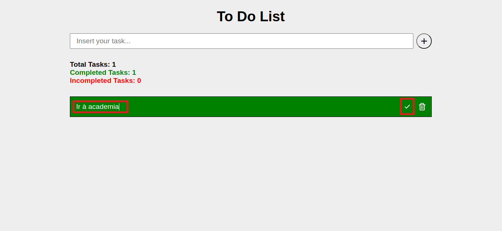
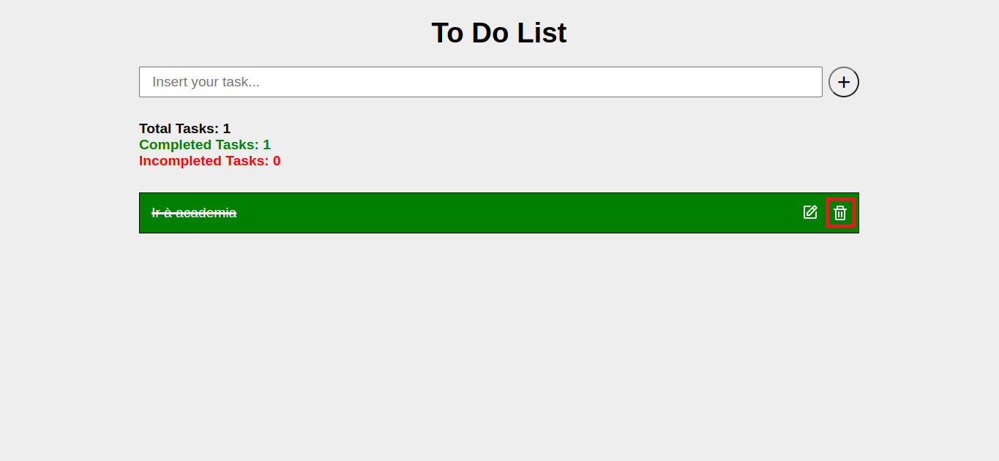

# To Do List

A To Do List helps you to create a list of tasks and organize it of your way.

## 🛠️ Built With

- 
- 
- 

## 👣 Step by Step

### Step 1

Access the app by the link: [To Do List](https://flaviosp15.github.io/todo-list/)

### Step 2

Insert a task in the input.

### Step 3

Click on Plus button and the task will added in the list.

### Step 4

With item added in the list, the user can mark as done task, edit task and delete task.

#### Done task

The user can mark task as done just clicking on this area.

#### Edit task

To edit a task you need to click on the edit icon.

Then an input is actived and the edit icon becomes checkmark icon.

Click on checkmark icon to rename your task.

#### Delete task

Click on trash icon to delete task.

## 🧠 Takeaways

- DOM manipulation
- Interactions with checkboxes
- Event listeners
- localStorage
